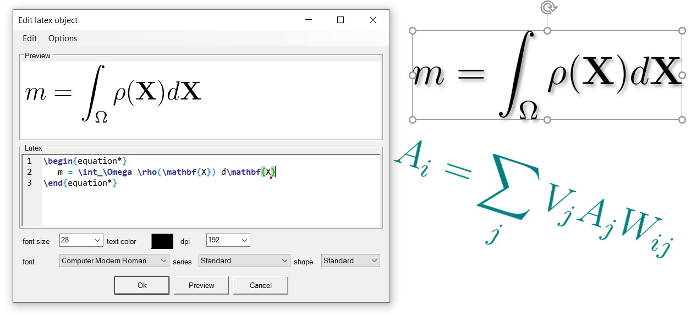

# Latex4PowerPoint
This is a Latex Add-In for Powerpoint. It enables to add and edit Latex equations or symbols in a Powerpoint slide easily. The Add-In is based on ScintillaNET and supports syntax highlighting, code snippets etc.

With the add-in you can open a dialog, enter something like $y = \sum_{i=0}^n x_i$ and you will get an equation in your slide. This is done by embedding  your Latex code in a template. Then, latex.exe is called in order to create a DVI which is afterwards converted in a PNG file by Ghostscript. The PNG is then inserted in your slide. Your Latex code is stored in  the generated PowerPoint object. Hence, you can edit your code later.



## Install Add-In

Download one of the release files and start the setup to install the add-in. The add-in should then be loaded automatically when starting PowerPoint the next time. 

Be sure that you install the correct version (x86 or x64).

## Build Add-In

First, you need Visual Studio with C# support. We tested the build using Visual Studio 2019. 

To build the add-in perform the following steps:

* clone repository from GitHub
* open solution file in Visual Studio
* select correct platform (x86 or x64) depending on your PowerPoint version
  * If you are not sure if you have a 32bit or 64bit version of PowerPoint, just start PowerPoint and open "File" -> "Account" -> "About PowerPoint".
* build the add-in
* start PowerPoint and the add-in should be loaded automatically

## Use Add-In

First, you must set the MiKTex path. That is the location of latex.exe

### Latex template

If you need other packages or want to define your own commands, you can edit the latex template. Just open "Options" - > "Edit Latex template" and it will be opened in a text editor. The default template looks like this:

```tex
\documentclass[12pt,a4paper]{article}
\usepackage{amsmath} 
\usepackage[utf8]{inputenc} 
\usepackage{bbm} 
\usepackage{ae,aecompl} 
\usepackage{color}
\newcommand{\changefont}[3]{\fontfamily{#1} \fontseries{#2} \fontshape{#3} \selectfont}
\setlength{\parindent}{0pt}
\begin{document} 
\thispagestyle{empty}

${Content}

\end{document}
```

Don't remove the command "\changefont" and the placeholder "${Content}" since they are needed by the add-in. "${Content}" will be replaced by your latex code.

### Code snippets & auto completion

Code snippets and auto completion are very helpful to write down equations very quickly. Auto completion can be performed by pressing "Ctrl + Space". Currently, the auto completion only knows some of the latex commands. However, you can easily extend the list of commands by editing the file "Language.xml" which is in the same folder as the Latex template. 

Code snippets can be added by pressing "Ctrl + J".  Currently, there are only a few snippets available. However, you can define new ones by editing the file "Language.xml" which is in the same folder as the Latex template. 


